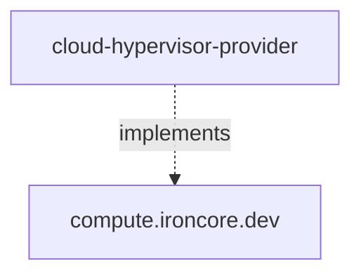

# Cloud-Hypervisor Provider

The `cloud-hypervisor-provider` project is a cloud-hypervisor (KVM) based provider implementation of the [ironcore](https://github.com/ironcore-dev/ironcore) types

Namely `cloud-hypervisor-provider` implements the [`Machine`](https://github.com/ironcore-dev/ironcore/blob/main/api/compute/v1alpha1/machine_types.go) type.
Additionally, it announces the available `MachineClasses` which are supported by the `MachinePool` based on configured
criteria.
